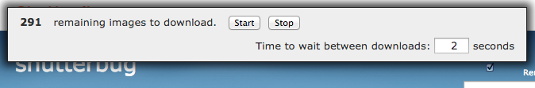

# shutterfly downloader bookmarklet

See [https://chbrown.github.io/shutterfly/](https://chbrown.github.io/shutterfly/) for easier-to-use instructions.

Harder-to-use instructions:

1. Add a bookmark to your browser's bookmarks bar (some browsers call it "favorites") with the contents of the [`bookmarklet.js`](https://raw.githubusercontent.com/chbrown/shutterfly/gh-pages/bookmarklet.js) file as the `URL`. The `Name` can be anything, e.g., "Shutterfly Downloader".
2. Go to the [Shutterfly](https://www.shutterfly.com/) album page you want to download (you _must_ be on the main album page, _not_ on one of the individual photos), and click the "All" link to show all images on a single page.
  * You don't _have_ to show all images, but that's the easiest way to download all the images at once.
3. "Open" the `Shutterfly Downloader` bookmark you created in Step 1. This will not open a new page, but will create a new bar at the top of the album page, which looks like this:
  
4. Click the "Start" button to download all the images in the album.
  * You can "Stop" and adjust the interval to wait between downloads, and then click "Start" to continue where you left off.
5. You may need to click "Allow" if your browser asks if you want to allow the page to download multiple files. This should happen within the first 3 or 4 downloads, and your browser _should_ remember what you chose, so this _should_ only happen once.

## License

Copyright 2015 Christopher Brown. [MIT Licensed](http://opensource.org/licenses/MIT).
